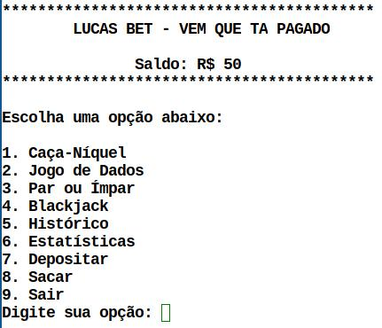

# 🎰 Lucas Bet - Simulador de Aposta

    

**Status:** ✅ Concluído  

O **Lucas Bet** é um simulador de jogos de aposta fictícios, criado para fins educativos e de entretenimento. O projeto explora a lógica de programação por trás de jogos de azar sem envolver dinheiro real.

## 🔧 Tecnologias Utilizadas

- **C++** para a lógica do jogo  
- **Gerenciamento de saldo fictício**  

## 📌 Funcionalidades

✔️ Simulação de jogos como caça-níquel, jogo de dados e blackjack  
✔️ Sistema de saldo fictício  
✔️ Histórico de apostas  
✔️ Estatísticas de ganhos e perdas 
✔️ Saques e Depositos com valor minimo

## 📥 Como Jogar   

1️⃣ Baixe o arquivo `lucas_bet.cpp`  
2️⃣ Compile o código com `g++ lucas_bet.cpp -o lucas_bet`  
3️⃣ Execute `./lucas_bet` no terminal  
4️⃣ Escolha o jogo e comece a diversão

---
